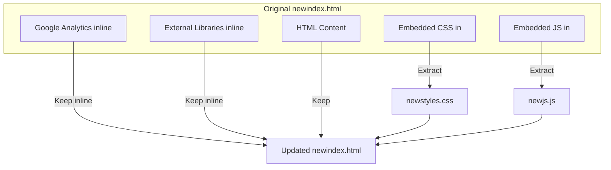

# Plan to Modularize `newindex.html` by Extracting CSS and JavaScript

---

## Objective
- Extract **all embedded CSS** into `newstyles.css`
- Extract **all embedded JavaScript** into `newjs.js`
- **Keep Google Analytics inline** in `<head>`
- Update `newindex.html` to link these new files
- Ensure **no breakage** in styles or functionality

---

## Step 1: Extract Embedded CSS

- **Source:** Lines 29-97 inside `<style>` in `<head>`
- **Action:**
  - Copy entire CSS content to a new file named `newstyles.css`
  - Remove the `<style>` block from `newindex.html`
  - Add this line in `<head>`, after Animate.css link:
    ```html
    <link rel="stylesheet" href="newstyles.css">
    ```

---

## Step 2: Extract Embedded JavaScript

- **Source:** Lines 783-950 inside `<script>` at the end of `<body>`
- **Action:**
  - Copy entire JavaScript content to a new file named `newjs.js`
  - Remove this `<script>` block from `newindex.html`
  - Add this line **before** the closing `</body>` tag:
    ```html
    <script src="newjs.js"></script>
    ```

---

## Step 3: Preserve External Dependencies

- **Keep inline in `<head>`:**
  - Google Analytics snippet
  - Tailwind CSS CDN
  - Animate.css CDN
  - Google Fonts
- **No changes** to these links/scripts.

---

## Step 4: Verify and Test

- Open `newindex.html` in a browser.
- Confirm:
  - All styles are applied correctly.
  - All interactive features work as before.
  - Google Analytics still loads.

---

## Visual Overview



---

## Summary Checklist

- [x] Extract **all embedded CSS** to `newstyles.css`
- [x] Extract **all embedded JavaScript** to `newjs.js`
- [x] Keep **Google Analytics** inline
- [x] Link new CSS and JS files in `newindex.html`
- [x] Preserve all external libraries
- [x] Maintain full styling and interactivity