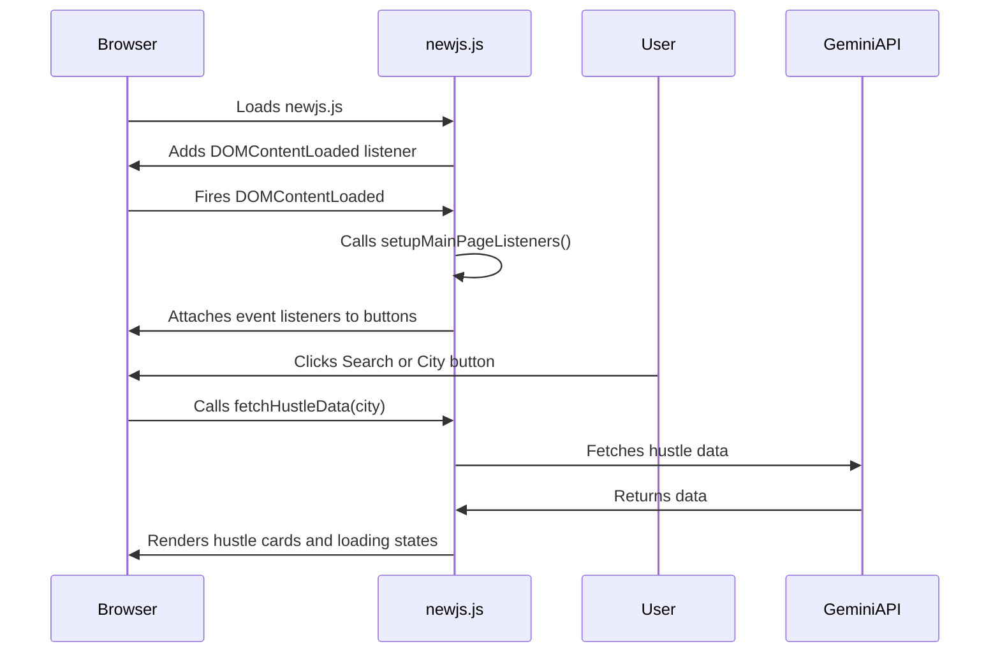

# Fix Plan: Restore Hustle Search & City Button Functionality

## Root Cause
- The refactored `newjs.js` **does not attach event listeners on page load**.
- No `DOMContentLoaded` initialization exists.
- Buttons do not trigger `fetchHustleData()` or show loading states.

---

## Solution Overview

1. **Add a DOMContentLoaded event listener** in `newjs.js`.
2. **Implement a `setupMainPageListeners()` function** that:
   - Attaches event listeners to:
     - Search button (`#get-hustle-btn`)
     - City buttons (`.city-btn`)
     - Refresh button (`#refresh-results`)
     - "Try again" button (`#try-again`)
   - Calls `setupButtonListeners()` and `setupHustleCardListeners()` as needed.
3. **Ensure event handlers call `fetchHustleData()`** with the correct city.
4. **Verify loading states and error handling work.**

---

## Implementation Details

### 1. Add DOMContentLoaded Listener

```js
document.addEventListener('DOMContentLoaded', () => {
  setupMainPageListeners();
});
```

### 2. Implement `setupMainPageListeners()`

```js
function setupMainPageListeners() {
  const cityInput = document.getElementById('city-input');
  const getHustleBtn = document.getElementById('get-hustle-btn');
  const cityBtns = document.querySelectorAll('.city-btn');
  const refreshResultsBtn = document.getElementById('refresh-results');
  const tryAgainBtn = document.getElementById('try-again');

  if (getHustleBtn && cityInput) {
    getHustleBtn.onclick = () => {
      const city = cityInput.value.trim();
      if (city) fetchHustleData(city);
      else showError('Please enter a city name');
    };
  }

  cityBtns.forEach(btn => {
    btn.onclick = () => {
      const city = btn.textContent.trim();
      cityInput.value = city;
      fetchHustleData(city);
    };
  });

  if (refreshResultsBtn) {
    refreshResultsBtn.onclick = () => {
      const city = document.getElementById('results-city')?.textContent.trim() || cityInput.value.trim();
      if (city) fetchHustleData(city);
    };
  }

  if (tryAgainBtn) {
    tryAgainBtn.onclick = () => {
      const city = cityInput.value.trim();
      if (city) fetchHustleData(city);
    };
  }

  // Setup other button listeners
  setupButtonListeners(currentDisplayedHustles, currentCity);
  setupHustleCardListeners(currentDisplayedHustles);
}
```

---

## Mermaid Diagram



---

## Summary

- This plan **restores all event listeners** needed for hustle search and city buttons.
- It **ensures `fetchHustleData()` is called** with the correct city.
- It **restores loading states and error handling**.
- It **modularizes event setup** for maintainability.