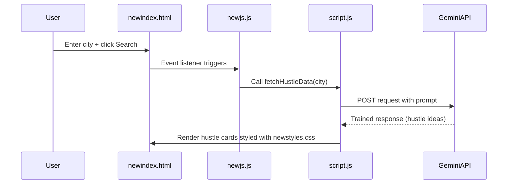

# Plan to Integrate Gemini API with `newindex.html`

---

## Objective
Replace the dummy card generation with **trained output** from the Gemini API, styled consistently, by leveraging existing Gemini integration code in `script.js`.

---

## Recommended Approach

### **Import `script.js` into `newindex.html` and reuse its Gemini integration**

---

## Reasons
- `script.js` already contains **robust, feature-rich Gemini API integration**:
  - API calls with API key
  - Parsing and formatting responses
  - Rendering styled hustle cards
  - Error handling, refresh, UI updates
- Avoids **duplicating complex code** in `newjs.js`
- Ensures **consistency** across your app
- **Faster, safer, and maintainable**
- Allows **gradual refactoring** later if needed

---

## Implementation Steps

1. **Import `script.js`** in `newindex.html` after `newjs.js`:
    ```html
    <script src="newjs.js"></script>
    <script src="script.js"></script>
    ```

2. **Update `newjs.js`:**
    - Remove dummy card generation logic.
    - Call `fetchHustleData(city)` from `script.js` when the user searches.

3. **Result:**
    - User enters a city and clicks search.
    - `newjs.js` triggers `fetchHustleData(city)`.
    - `script.js` calls Gemini API, parses response, and renders styled cards.
    - The output is **trained, dynamic, and styled** with `newstyles.css`.

---

## Mermaid Diagram



---

## Summary
- **Reuse existing Gemini integration in `script.js`**
- **Wire up search input/button in `newjs.js` to call `fetchHustleData(city)`**
- **Display trained output styled with `newstyles.css`**

---

## Next Step
Switch to implementation mode and update the project accordingly.